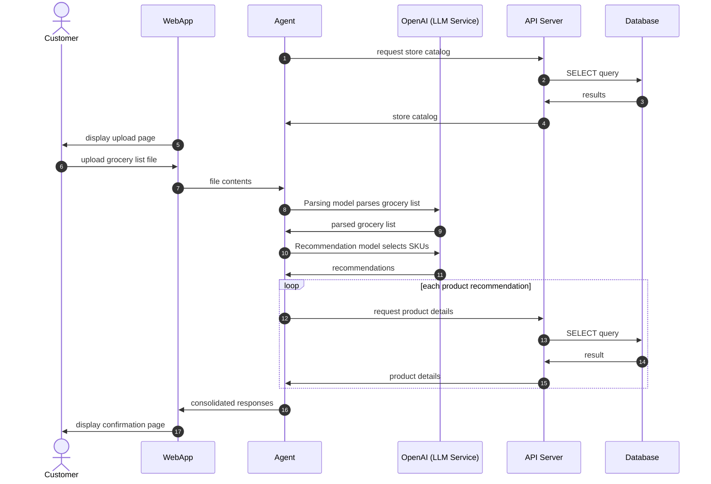
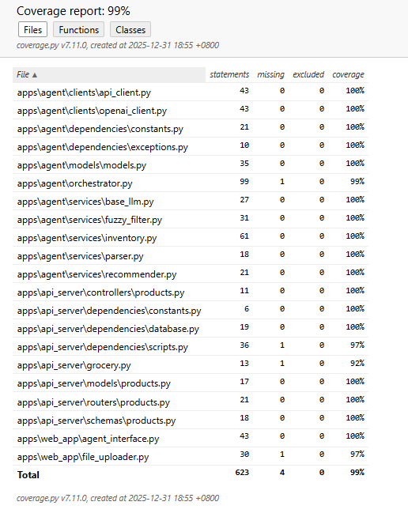

# Grocery Recommender System

An **AI-powered system** that interprets free-form grocery lists and recommends structured product matches from a store catalog.

---

## Project Summary

This proof-of-concept demonstrates how a backend service can use AI to understand natural-language grocery orders and map them to structured SKUs and pricing data.
It combines **API design**, **AI integration**, and **database querying** in one cohesive, end-to-end demo.

Below is the sequence diagram describing the complete system flow:



**Steps 1–4** are performed once when the **agent** initializes.
It queries the **API server** for the store catalog (SKU, name, brand), and caches this data in memory.

In **steps 5–7**, the **web application** allows the customer to upload a grocery list file. The file’s contents are sent to the **agent**, which handles all AI-related tasks.

In **steps 8–11**, the **agent** calls the OpenAI API ([https://platform.openai.com/
]) twice:

1. First to **parse** the grocery list into structured items.
2. Then to **recommend** products based on that parsed output and the in-memory catalog.

For each recommended product, the **agent** performs **steps 12–15** to fetch price and inventory details from the API server.

Finally, in **steps 16–17**, the **agent** consolidates everything and sends a summary to the **web application**, which displays a confirmation page for the customer.

---

## Tools

- **Flask** – Web server hosting the upload and confirmation pages.
- **FastAPI** – Backend API server handling catalog and product detail requests.
- **OpenAI** – Parses grocery lists and recommends products based on parsed results.
- **SQLite** – Lightweight database storing inventory information.

---

## Setup Instructions

First ensure that `uv` is already set up on your machine.
More information on `uv` is available at: [https://docs.astral.sh/uv/](https://docs.astral.sh/uv/)

1. Clone this repository to an appropriate folder on your local machine. Assume this folder is at:

   ```bash
   path/to/repository/grocery-recommender/
   ```

2. Create a virtual environment and install dependencies. From the project root, run:

   ```bash
   uv sync
   ```

3. Create the environment file:

   ```bash
   path/to/repository/grocery-recommender/.env
   ```

   (Refer to **Environment Setup** below for details.)

4. Optionally execute the unit tests (see **Unit Testing** below).

5. Start each application in the following order:

   1. API Server (`apps/api_server`)
   2. Web Application (`apps/web_app`)

   Refer to each application’s `README.md` for execution details.

---

## Environment Setup

The project uses an environment file (`.env`) for credentials and runtime configuration.

To enable live OpenAI-powered parsing and recommendations, add:

```bash
OPENAI_API_KEY=<your OpenAI API key>
```

### Dummy Mode

If the `.env` file is missing or `OPENAI_API_KEY` is not set, the system automatically runs in **dummy mode**.

In dummy mode:

- No external OpenAI API calls are made.
- The Agent returns **pre-recorded parser and recommender responses**.
- Responses are selected based on the uploaded grocery list filename.
- This allows the entire system to run deterministically without external dependencies.

Dummy mode is intended for **development, testing, and demo purposes**.
See the **Agent README** for details on the sample files and response mappings.

---

## Unit Testing

All three applications in this project include unit tests implemented with **pytest** and integrated **coverage** tracking.

Run the full test suite with:

```bash
uv run pytest --cov-config=tests/results/.coveragerc | tee tests/results/results.txt
```

This command will:

- Save the full test log to `tests/results/results.txt`
- Generate an HTML coverage report at `tests/results/cov_html/index.html`

You can open the HTML report in your browser to explore detailed coverage results.
Here is a screenshot:

  

> **Note:** The project uses two separate configuration files by design:

- `pytest.ini` — controls pytest behavior (test discovery, source paths, report locations and global options).
- `.coveragerc` — controls coverage settings (file exclusions).

Keeping these configurations separate ensures clarity and makes it easier to fine-tune testing and coverage independently.

---

## Repository Structure

```bash
    grocery-recommender/
    │
    ├── apps/               # folder containing the applications
    │   ├── agent/          # files for the agent application
    │   ├── api_server/     # files for the API server
    │   └── web_app/        # files for the web application
    ├── assets/             # folder containing project screenshots
    ├── tests/              # folder containing the unit tests of the applications
    │   ├── agent/          # files for testing the agent application
    │   ├── api_server/     # files for testing the API server
    │   ├── web_app/        # files for testing the web application
    │   └── results/        # test results
    ├── .env                # credentials file
    ├── .python-version     # Python version
    ├── pyproject.toml      # project settings
    ├── pytest.ini          # pytest settings
    ├── uv.lock             # project dependency settings
    └── README.md
```

---

## Suggested Extensions

This architecture is intentionally modular — it can evolve into a production-grade system with minimal redesign.

- **Service decomposition**:
While currently contained in a monorepo, the **web app**, **agent**, and **API server** can be deployed as microservices.

- **Decoupled communication**:
The agent currently acts as a backend for the web app. This can later be replaced with asynchronous communication via a message queue.

- **Two-model design**:
A production system can separate language understanding and product retrieval into two models:

1. A large model for **parsing** natural-language inputs.

2. A smaller, context-aware model for **recommendations** (possibly using RAG or embeddings).
This approach balances **accuracy**, **cost**, and **specialization**.

- **Retrieval-augmented generation (RAG)**:
In production, the **agent’s catalog query** could be replaced by a vector database or a service like **AWS Bedrock Knowledge Base**, removing the need to cache product data in memory.

The architecture is designed for **small-to-medium retailers** but can scale to **enterprise-grade** infrastructures through modular substitution of the AI and retrieval layers.

- **Integrate customer context** (e.g., purchase history, preferred brands, dietary restrictions) to further personalize recommendations. This information can be retrieved from a user profile service and included in the prompt or RAG context.

---

## Model Architecture Overview

The project’s AI logic is organized around a **two-model concept** — implemented using OpenAI’s GPT models, but designed to reflect a production-style architecture.

---

### 1. Parsing Model (Powerful LLM)

- Handles natural-language understanding.  
- Interprets free-form grocery list entries (e.g., “3 packs of almond milk”) into structured data containing `item`, `quantity`, and `unit`.  
- Outputs **structured JSON**, ensuring the next model receives clean, predictable input.  
- In a production deployment this role would typically be handled by a large language model (LLM) via a managed service (for example, **Amazon Bedrock**) or a specialized NLP pipeline.

---

### 2. Recommendation Model (Lightweight LLM)

- Takes the parsed grocery list output and a **filtered subset of the store catalog.**
- Selects the most relevant SKUs and assigns a confidence score to each recommendation.
- Returns results using strict structured outputs, validated against a predefined schema.
- Requires less reasoning power than parsing because the input is already structured and the candidate set is constrained.
- In production, this stage would typically be replaced by a **vector search / RAG (retrieval-augmented generation) pipeline** backed by embeddings and a retrieval system.

---

### Rationale for model selection

- Parsing is **precision-critical**, so a powerful model is used.  
- Recommendation is **context-driven** and uses structured input, so a lighter model suffices.  
- This pattern demonstrates thoughtful resource allocation and clearly illustrates the **two-model architecture**.  

> **Note:** Both models are implemented via OpenAI in this demo for simplicity.  
> In a production environment, different models or providers may be used for each role.  
> The architecture is intentionally modular to allow for swapping of components.

---

### Agent Design Pattern — Plan-and-Execute

This system follows a simplified **Plan-and-Execute agent pattern**, where one model interprets user input (“planning”) and another model executes based on that structured output. In this design, the parsing acts as the planning phase, producing a well-defined representation of the user’s intent. The recommendation phase acts as the execution stage, using that structured plan together with the store catalog to generate product matches. This mirrors the architecture used in many real-world production AI pipelines: deterministic orchestration with clearly separated model responsibilities, rather than an autonomous free-form agent loop.
