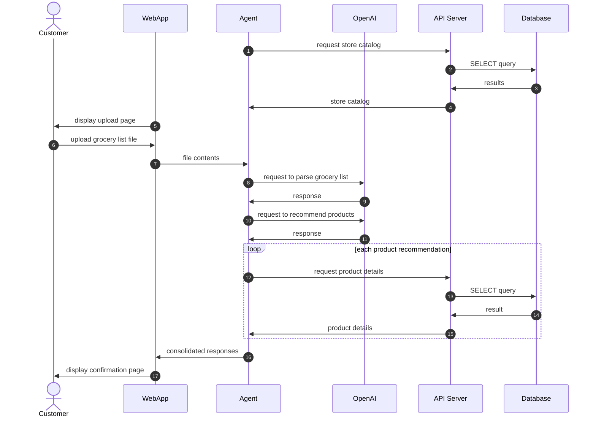

# Grocery Recommender System

An **AI-powered system** that interprets free-form grocery lists and recommends structured product matches from a store catalog.

---

## Project Summary

This proof-of-concept demonstrates how a backend service can use AI to understand natural-language grocery orders and map them to structured SKUs and pricing data.
It combines **API design**, **AI integration**, and **database querying** in one cohesive, end-to-end demo.

Below is the sequence diagram describing the complete system flow:

**Steps 1–4** are performed once when the **agent** initializes.
It queries the **API server** for the store catalog (SKU, name, brand), and caches this data in memory.

In **steps 5–7**, the **web application** allows the customer to upload a grocery list file. The file’s contents are sent to the **agent**, which handles all AI-related tasks.

In **steps 8–11**, the **agent** calls the OpenAI API ([https://platform.openai.com/
]) twice:

1. First to **parse** the grocery list into structured items.
2. Then to **recommend** products based on that parsed output and the in-memory catalog.

For each recommended product, the **agent** performs **steps 12–15** to fetch price and inventory details from the API server.

Finally, in **steps 16–17**, the **agent** consolidates everything and sends a summary to the **web application**, which displays a confirmation page for the customer.

---

## Tools

- **Flask** – Web server hosting the upload and confirmation pages.
- **FastAPI** – Backend API server handling catalog and product detail requests.
- **OpenAI** – Parses grocery lists and recommends products based on parsed results.
- **SQLite** – Lightweight database storing inventory information.

---

## Environment Setup

The project uses an environment file (`.env`) for credentials:

    OPENAI_API_KEY=<your OpenAI API key>

---

## Repository Structure

    grocery-recommender/
    │
    ├── apps/               # folder containing the applications
    │   ├── agent/          # files for the agent application
    │   ├── api_server/     # files for the API server
    │   └── web_app/        # files for the web application
    │
    ├── tests/               # folder containing the unit tests of the applications
    │   ├── agent/          # files for testing the agent application
    │   ├── api_server/     # files for testing the API server
    │   └── web_app/        # files for testing the web application
    ├── .env                 # credentials file
    └── README.md

---

## Suggested Extensions

This architecture is intentionally modular — it can evolve into a production-grade system with minimal redesign.

- **Service decomposition**:
While currently contained in a monorepo, the **web app**, **agent**, and **API server** can be deployed as microservices.

- **Decoupled communication**:
The agent currently acts as a backend for the web app. This can later be replaced with asynchronous communication via a message queue.

- **Two-model design**:
A production system can separate language understanding and product retrieval into two models:

1. A large model for **parsing** natural-language inputs.

2. A smaller, context-aware model for **recommendations** (possibly using RAG or embeddings).
This approach balances **accuracy**, **cost**, and **specialization**.

- **Retrieval-augmented generation (RAG)**:
In production, the **agent’s catalog query** could be replaced by a vector database or a service like **AWS Bedrock Knowledge Base**, removing the need to cache product data in memory.

The architecture is designed for **small-to-medium retailers** but can scale to **enterprise-grade** infrastructures through modular substitution of the AI and retrieval layers.

---
