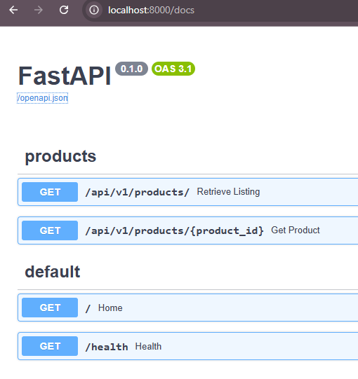
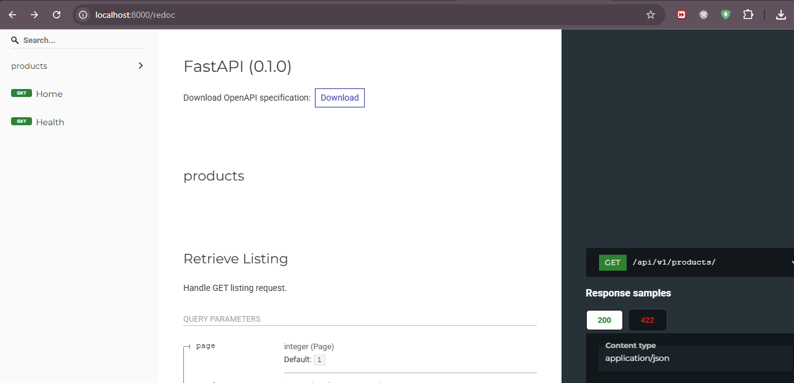
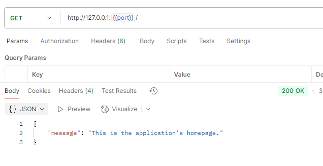
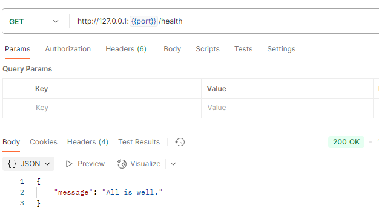
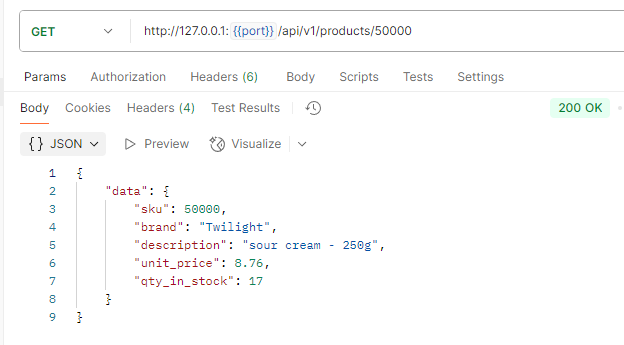
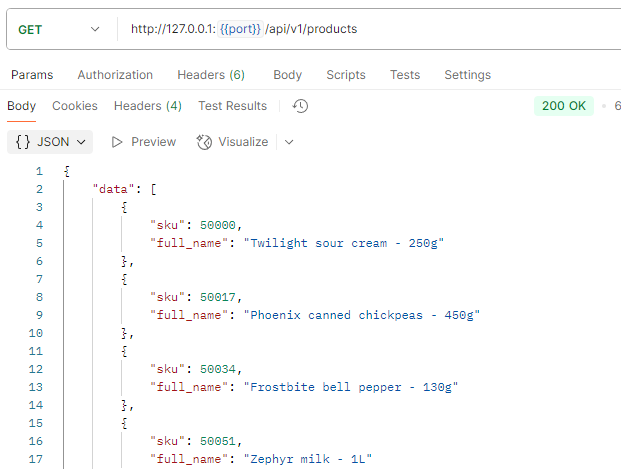
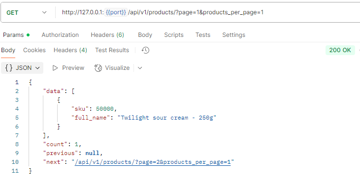
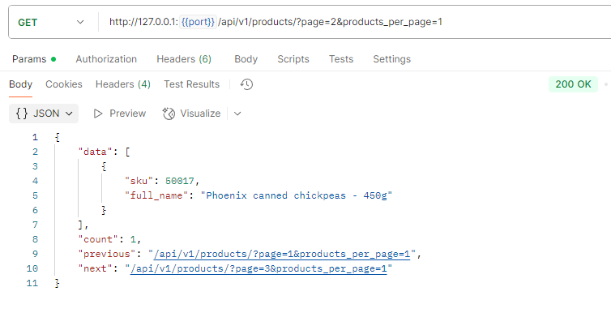
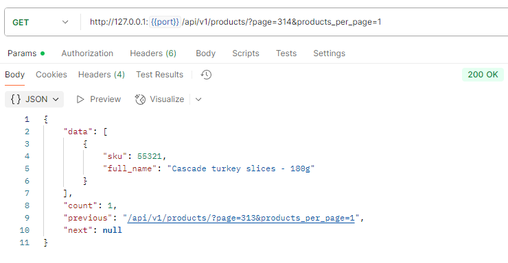
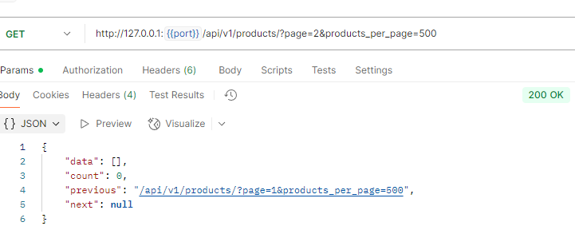

# API Server

## Overview

The **API Server** provides the **product catalog and lookup service** for the Grocery Recommender System.
It exposes a clean REST interface that the **agent** uses to:

* Load the entire store catalog on startup
* Look up product details by ID

This service acts as the system’s **data layer**, backed by a lightweight SQLite + SQLModel database.

---

## Features

The API Server is a FastAPI-based application responsible for:

* Serving the full product catalog (`GET /api/v1/products`)
* Retrieving product details (`GET /api/v1/products/{product_id}`)
* Backing data with a SQLite database using **SQLModel**
* Providing strict separation between **data**, **agent logic**, and **UI**

---

## Architecture

The API server is the **data layer** of the three-service system:

```bash
User
  ↓
Web App (Flask)
  ↓
Agent (LLM-powered parsing + recommendations)
  ↓
API Server (product catalog / inventory)
```

---

## Data Flow Summary

1. The agent starts and requests the entire store catalog from the API Server.
2. The agent parses the user’s grocery list via LLM.
3. For each parsed item, the agent queries the API Server for matches or details.
4. The agent produces a structured recommendation payload.
5. The web application renders this payload into a final confirmation page.

This clear separation ensures that **product data responsibilities remain isolated**, allowing the agent and UI to evolve independently.

---

## Tech Stack

* **FastAPI** — high-performance, typed REST framework
* **SQLModel** — ORM + pydantic-style models
* **SQLite** — simple embedded datastore
* **Uvicorn** — ASGI server
* **Python Standard Library** — seeding, utilities

---

## Running the Application

### 1. Initialize the Database (One-Time Setup)

Before starting the API server, create and seed the SQLite database using the provided setup script:

```bash
uv run python apps/api_server/dependencies/scripts.py --create --seed
````

This only needs to be run **once**, unless you intentionally want to recreate the database.

---

### 2. Start the API Server

Launch the FastAPI application:

```bash
uv run python apps/api_server/grocery.py
```

The server will be available at:

**[http://localhost:8000](http://localhost:8000)**

---

## Endpoints

| Endpoint                 | Method | Description                            |
| ------------------------ | ------ | -------------------------------------- |
| `/`                | GET    | Homepage endpoint                  |
| `/health`                | GET    | Health check endpoint                  |
| `/api/v1/products`              | GET    | Returns a product listing             |
| `/api/v1/products/{product_id}` | GET    | Returns details for a specific product |

---

## Database

The database is powered by **SQLite + SQLModel**.

This ensures **zero setup** for development while maintaining proper isolation from the web and agent layers.

### Note on Database Initialization Strategy

The database creation and seeding logic is intentionally implemented using **raw SQL executed directly on the SQLite driver**, rather than SQLModel ORM commands.

This design allows for a clean **separation of concerns**:

* **Database engineers or SQL specialists** can modify the schema and write seed data using the full power of SQL (indexes, constraints, triggers, bulk inserts, etc.).
* **FastAPI developers** do not need to translate SQL logic into ORM code.
* The application simply consumes the resulting database through SQLModel sessions, without being tied to how the database was initialized.

This mirrors production environments where schema creation and migrations are handled outside the application layer, making the system more flexible and easier to maintain.

---

## Screenshots

### Documentation

FastAPI automatically generates interactive API documentation.  

* **Swagger Docs:** [http://localhost:8000/docs](http://localhost:8000/docs)  
  

* **Redoc Docs:** [http://localhost:8000/redoc](http://localhost:8000/redoc)  
  

The OpenAPI specification for all endpoints is also saved at `apps/api_server/assets/openapi.json`.

---

### Server Endpoints

For testing endpoints, the Postman collection used is saved at `apps/api_server/assets/grocery.postman_collection.json`.

#### Home Page

Displays the API Server's home page:



#### Health Check

Displays a health check of the API Server:



#### Product Details (Existing Product)

Displays details for a product that exists in the store inventory:



#### Product Details (Non-Existing Product)

Displays an error for a product that does not exist, showing the HTTP 404 response:


#### Product Listing (Default)

Displays the first 50 products when no query parameters are provided:



#### Product Listing (1 Product per Page)

Since 314 products were seeded, setting 1 product per page creates 314 pages. The `metadata` updates with `previous` and `next` links accordingly:

* Page 1 of 314:   
* Page 2 of 314:   
* Page 314 of 314: 

#### Product Listing (500 Products per Page)

Since only 314 products exist, requesting 500 per page results in an empty page for page 2:



---

## Testing

Unit tests for the API Server are located in:

```bash
tests/api_server/
```

Tests cover:

* Endpoint behavior
* Database initialization
* Product lookup logic

Run only the API Server tests using:

```bash
pytest --cov apps/api_server tests/api_server
```

Mocks ensure fast, deterministic tests.

---

## Notes

This component has a **single responsibility**: provide reliable, structured product data.

* **Web App:** UI, file validation, rendering
* **Agent:** Parsing, LLM calls, reasoning
* **API Server:** Catalog + inventory lookups

Keeping this boundary strict ensures a clean architecture and long-term maintainability.

---
