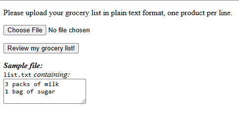
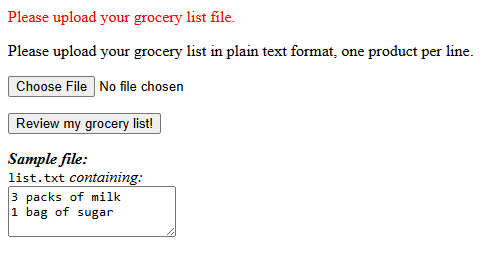
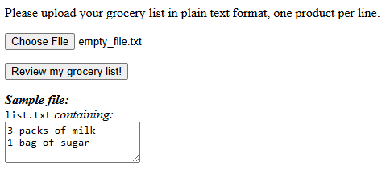
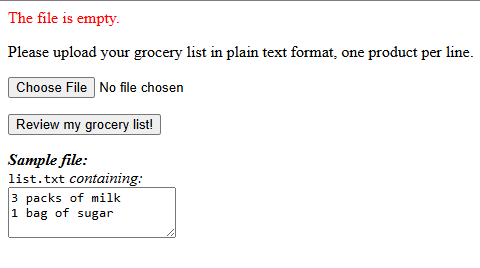
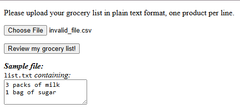
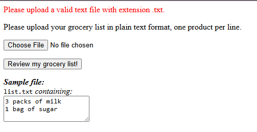
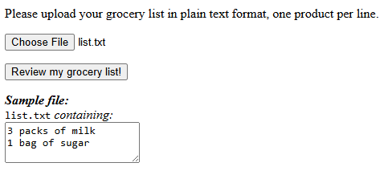

# Web Application

## Overview

This component provides the **frontend interface** for the Grocery Recommender System.
It allows customers to upload grocery list files and displays the resulting product recommendations generated by the **agent** application.

This service acts purely as a **UI layer** — it contains no business logic, no parsing, no recommendation logic, and no database access.

---

## Features

The **web application** is a lightweight Flask server responsible for:

* Rendering the **Upload Page** (`/`)
* Validating and accepting uploaded grocery list files
* Forwarding file contents to the **agent**
* Receiving the agent’s consolidated recommendation payload
* Rendering the **Confirmation Page** displaying the recommendations

---

## Architecture

The web application is the **presentation layer** in a three-service system:

```bash
User
  ↓
Web App (Flask)
  ↓
Agent (LLM-powered parsing + recommendations)
  ↓
API Server (product catalog / inventory)
```

## Data Flow Summary

1. User uploads a grocery list file.
2. Web app validates the file and sends the contents to the **agent**.
3. Agent processes the list (LLM + product knowledge + API server lookups).
4. Agent returns a structured recommendation payload.
5. Web app renders the final confirmation page to the user.

This clear separation ensures maintainability and allows the agent and API server to evolve independently of the UI.

---

## Tech Stack

* **Flask** — lightweight server and routing
* **Jinja2** — templating for pages
* **HTML/CSS** — simple UI
* **Python Standard Library** — file handling, validation

---

## Running the Application

From the root of the repository:

```bash
uv run python apps/web_app/file_uploader.py
```

The Flask server starts at:

**[http://localhost:5000](http://localhost:5000)**

---

## Endpoints

| Endpoint       | Method | Description                                             |
| -------------- | ------ | ------------------------------------------------------- |
| `/`            | GET    | Upload page for the grocery list file                   |
| `/recommender` | POST   | Receives agent output and renders the confirmation page |

---

## Screenshots

### Homepage

Displays the file upload interface:



The user selects a grocery list file and submits it to the **agent** via the *Review my grocery list!* button.

---

### No File Uploaded

If the user attempts to submit without selecting a file:



---

### Empty File Uploaded

Uploading an empty text file triggers a validation error:




---

### Invalid File Uploaded

If the uploaded file is not a valid text file:




---

### Valid File Uploaded

When a valid grocery list file is uploaded:



The web app forwards the text to the **agent**, receives structured recommendations, and renders them:


---

## Testing

Unit tests for the web application are located in:

```bash
tests/web_app/
```

The tests cover:

* Page rendering
* File upload behavior
* Agent interaction using mocked responses

To run only the web app tests:

```bash
 uv run pytest --cov apps/web_app tests/web_app
```

Mocks are used to avoid calling the real agent or the OpenAI API.
This keeps tests **fast, deterministic, and isolated** while still validating UI-layer behavior.

---

## Notes

The web application intentionally contains **no intelligence or domain logic**.
This design ensures a strict separation of concerns:

* **Web App:** UI, validation, routing
* **Agent:** Parsing, reasoning, LLM calls, recommendation logic
* **API Server:** Catalog + inventory lookups

All heavy lifting happens outside this component, keeping the UI layer simple, fast, and maintainable.

---
